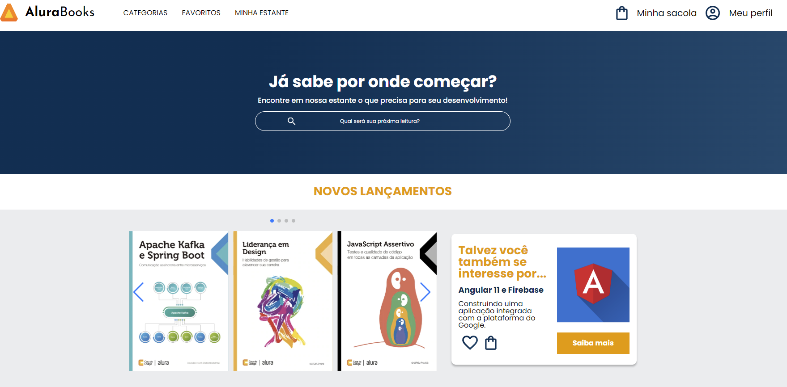

<h1 align="center"> Book Store Demo</h1>

Projeto Front-end para uma loja de livros online. 

  <a href="#-tecnologias">Tecnologias</a>&nbsp;&nbsp;&nbsp;|&nbsp;&nbsp;&nbsp;
  <a href="#-projeto">Projeto</a>&nbsp;&nbsp;&nbsp;|&nbsp;&nbsp;&nbsp;
  <a href="#-layout">Layout</a>&nbsp;&nbsp;&nbsp;|&nbsp;&nbsp;&nbsp;

  

 

  

    
  

 
 

## 🚀 Tecnologias

Esse projeto está sendo desenvolvido com as seguintes tecnologias:

<li> HTML
<li> CSS
<li> Figma
<li> Git and GitHub

## 💻 Projeto

Foi utilizado a metodologia "BEM" neste projeto e "Mobile First", que se entende por qualquer projeto web que leve em consideração a usabilidade em dispositivos móveis primeiro.

Foi usado flexbox, listas e ancoras, menu suspenso interativo, com botão hamburguer sem o uso do JavaScript estilizado com uso de pseudo classes ":hover" e ":checked", uso de combinadores tipo "~" no css. 

Usamos o <a target="_blank" href="https://swiperjs.com/">"SwiperJs"</a>, que é um framework de javascript criado e utilizado para a apresentação na forma de slides de uma forma moderna, estilizada e fácil de se implementar, disponível também em Angular, Vue, Solid, Svelte e React. 

Foi feito o uso de "media-queries" para implementação dos layouts de responsividade conforme projeto desenvolvido no Figma para:  

<li>Mobile (min-width; 428px); 
<li>Tablet (min-widtth: 1024px);
<li>Desktop (min-width: 1728px). 

 Para visualizar a versão atual do projeto é só<a href="https://osdeving.github.io/book-store/"> "Clicar aqui".</a>🚀

## 🔖 Layout
🖼️ Projeto no FIGMA. 

## :memo: Licença

Este projeto está sob a licença MIT.
 
---

Feito ❤️‍ by Willams "osdeving" Sousa inspirado no Alura Books desenvolvido por Roberto Junior 😁:wave: 
 
    
<h4> Obrigado por visitar meu Git e se chegou até aqui dê um "Follow" que retribuo, podemos nos conectar para trocas de ideias e novos projetos.
   
   

 Até a próxima! 😁🖖.
